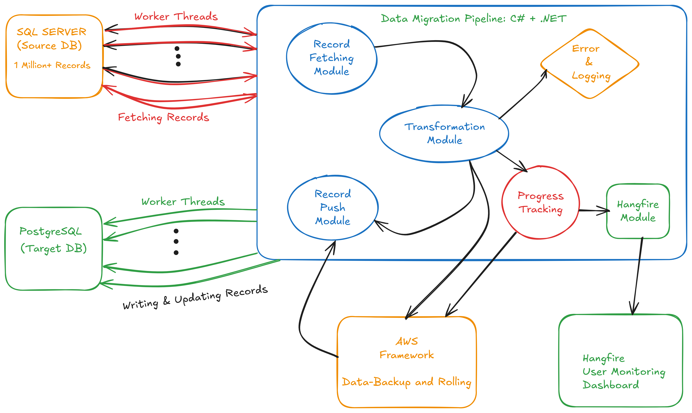

# Database Migration Automation: SQL Server to PostgreSQL

This repository contains a robust **Database Migration Automation** system built using C# and .NET. The project is designed to migrate over 1 million records from SQL Server to PostgreSQL with unparalleled efficiency, leveraging Docker containers, multi-threading, and automation tools like Hangfire. 

---

## Key Features

### 1. Multi-threaded Automation
- Simultaneous fetching and pushing of records.
- Completes migration of over 1 million records within a minute.
- Ensures high efficiency and rapid execution.

### 2. Zero Downtime During Migration
- The migration process is designed to handle record requests simultaneously.
- Ensures uninterrupted access to records even during migration.

### 3. Hangfire Dashboard Integration
- Real-time monitoring of the migration pipeline.
- Provides detailed insights into task statuses and logs.

### 4. Backup and Rollback Automation with AWS EC2
- Automatic periodic backups using a multi-threaded approach.
- Triggers backups after every significant database update.
- Facilitates rollback to previous versions for enhanced reliability.

### 5. Advanced PostgreSQL Features
- Cross-platform compatibility (Windows, macOS, Linux).
- Extensibility with custom types and plugins.
- Superior performance for complex queries and large datasets.

---

## System Architecture

### Components
1. **Dockerized Environments**
   - **SQL Server**: Containerized instance hosting the source database.
   - **PostgreSQL**: Containerized instance as the target database.

2. **Migration Pipeline**
   - Written in C# and .NET.
   - Implements automation for data migration.

3. **Monitoring**
   - Hangfire dashboard for tracking migration and backup processes.

---



## Advantages of PostgreSQL over SQL Server

| Feature              | PostgreSQL                         | SQL Server                     |
|----------------------|------------------------------------|---------------------------------|
| Developer           | Open-source, community-maintained | Microsoft Corporation          |
| License             | Free and open-source              | Proprietary                    |
| Platform            | Cross-platform                    | Windows/Linux                  |
| Advanced Features   | JSON, arrays, full-text search    | Business application-oriented  |
| Performance         | Optimized for complex queries     | High-throughput transactions   |
| Extensibility       | Highly extensible                 | Less extensible                |
| Popularity          | Preferred by developers/startups  | Corporate environments         |

---

![Placeholder for Comparison Table Screenshot]

## How It Works

### Step 1: Setup Docker Containers
1. Pull the required Docker images for SQL Server and PostgreSQL.
2. Configure the containers with sample databases.

### Step 2: Configure the Migration Pipeline
- Update the connection strings for SQL Server and PostgreSQL in the pipeline.
- Specify additional settings such as backup intervals and rollback policies.

### Step 3: Execute the Migration
- Launch the migration via Hangfire.
- Monitor progress through the dashboard.

![Placeholder for Hangfire Screenshot]

### Step 4: Automatic Backups
- Use AWS EC2 for storing incremental backups.
- Automatically trigger backups after significant updates.

---

![Placeholder for Backup Process Diagram]

## Installation Guide

1. Clone the repository:
   ```bash
   git clone https://github.com/yourusername/database-migration-automation.git
   ```

2. Build and run Docker containers:
   ```bash
   docker-compose up -d
   ```

3. Configure the connection settings in `appsettings.json`.

4. Run the migration pipeline:
   ```bash
   dotnet run
   ```

5. Access the Hangfire dashboard at `http://localhost:5000/hangfire`.

---

![Placeholder for Installation Process Screenshot]

## Monitoring and Logging

- **Hangfire Dashboard**: Provides a visual representation of all tasks.
- **Logs**: Captures detailed execution logs for debugging and auditing purposes.

---

![Placeholder for Monitoring Screenshot]

## Contributing

Contributions are welcome! If you'd like to contribute:
1. Fork the repository.
2. Create a feature branch.
3. Submit a pull request.

---

## License

This project is licensed under the MIT License. See the `LICENSE` file for details.

---

## Contact

For any queries, feel free to reach out:
- **Email**: your.email@example.com
- **GitHub**: [yourusername](https://github.com/yourusername)

---

Thank you for exploring the **Database Migration Automation** project!
